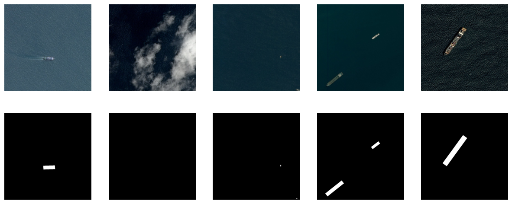
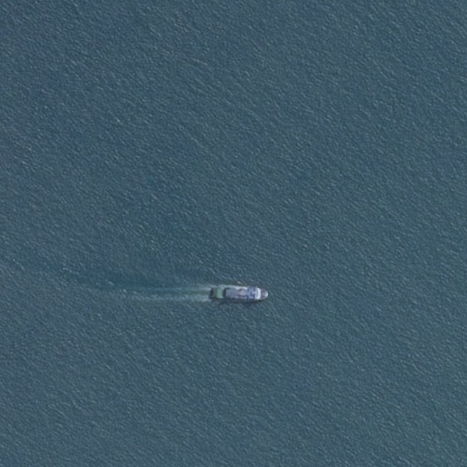
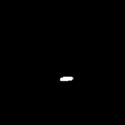
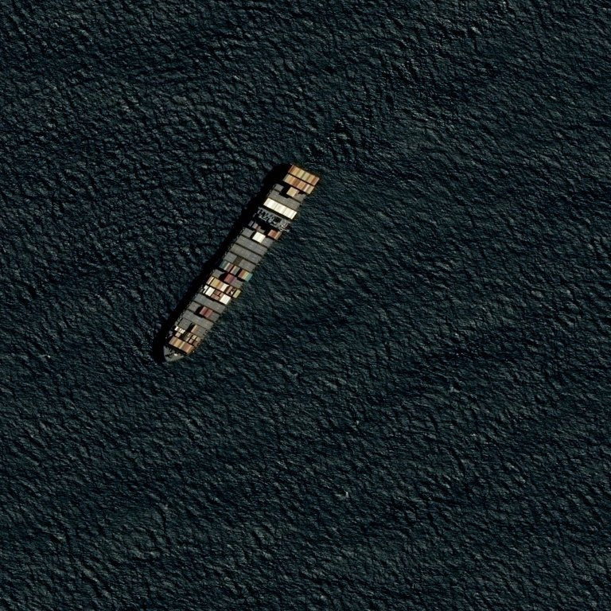
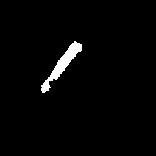
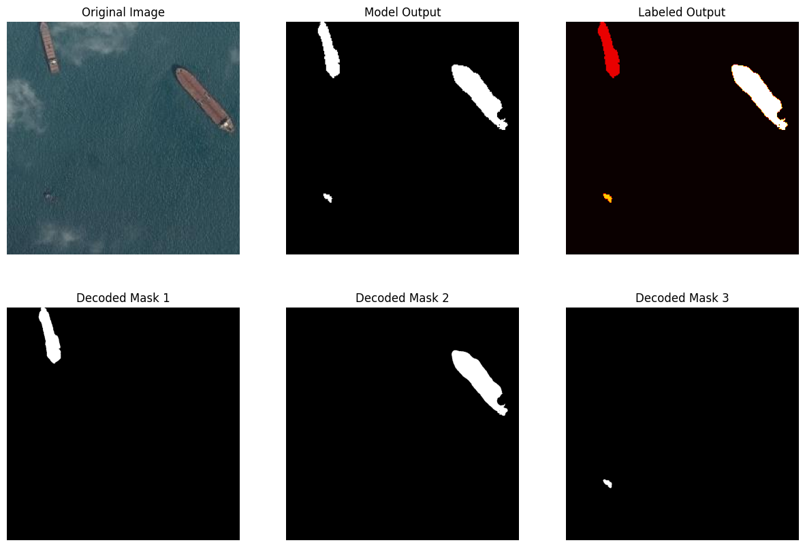
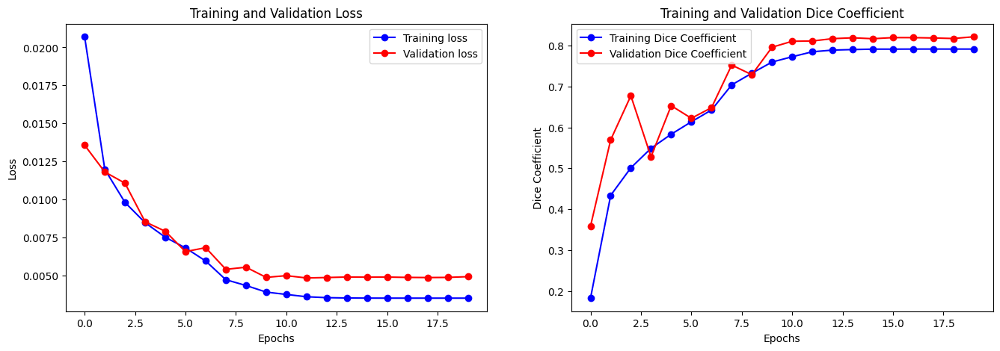

# Airbus Ship Detection Challenge

Welcome to my repository for the Airbus Ship Detection Kaggle competition! In this competition, the goal is to build a model that efficiently detects ships in satellite images, even in challenging conditions such as cloud cover or haze. 


## Dataset
The data for this project is obtained from the [Airbus Ship Detection](https://www.kaggle.com/c/airbus-ship-detection)  Kaggle competition. The dataset consists of satellite images captured under various conditions, along with corresponding labels indicating the presence of ships.




## Model architecture
The U-Net architecture, crucial to this project, is implemented within the _model.py_ file. U-Net's contracting path extracts features, while the expanding path ensures precise localization. Known for its proficiency in generating accurate segmentation masks with limited training data, U-Net is well-suited for tasks like ship detection in satellite imagery.


## Model predictions
|               Input image                 |                 Predicted mask                        |
|:-----------------------------------------:|:-----------------------------------------------------:|
|  |  |

|               Input image                 |                 Predicted mask                        |
|:-----------------------------------------:|:-----------------------------------------------------:|
|  |  |




## Metrics
For evaluating the performance of the model, I utilize the Dice Coefficient as the primary metric along with the loss function during training and validation. <br>
After training, the model achieved a validation Dice coefficient of 0.8.



## Usage

### Requirements
* Python 3.5+

### Setup
* Clone repository
```bash
  git clone https://github.com/SoulHb/Airbus.git
```

* Move to project folder
```bash
  cd Airbus-ship-detection
```

* Install dependencies
```bash
  pip install -r requirements.txt
```


## Conclusion
This solution provides a comprehensive, end-to-end pipeline for ship detection in satellite images. From robust data preprocessing and a tailored U-Net architecture to efficient model training and submission generation, every aspect is meticulously crafted to address the challenges posed by the Airbus Ship Detection Kaggle competition.
